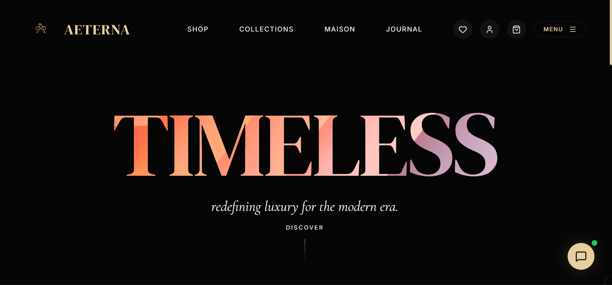

# AETERNA - Timeless Luxury Website


AETERNA is a meticulously crafted luxury e-commerce website, designed to offer a seamless and premium shopping experience. Featuring elegant UI, smooth animations, comprehensive product management, and robust user authentication, this platform embodies sophistication and functionality.

## Badges

[](https://opensource.org/licenses/MIT)
[](https://www.typescriptlang.org/)
[](https://react.dev/)
[](https://vitejs.dev/)
[](https://supabase.com/)
[](https://aterna.vercel.app)
[](https://github.com/AdityaRoy999/aterna_website)
[](https://github.com/AdityaRoy999/aterna_website/stargazers)
[](https://github.com/AdityaRoy999/aterna_website/network/members)

## GitHub Star History


## Screenshots

Explore the elegant design and user interface of AETERNA.



## Tech Stack

The AETERNA website leverages a modern and robust technology stack to deliver a high-performance and scalable application.

| Category          | Technology           | Description                                                                 |
| :---------------- | :------------------- | :-------------------------------------------------------------------------- |
| **Frontend**      | React.js             | A declarative, component-based JavaScript library for building user interfaces. |
|                   | TypeScript           | A strongly typed superset of JavaScript for enhanced code quality.          |
|                   | Vite                 | A next-generation frontend tooling that provides an incredibly fast dev experience. |
|                   | Tailwind CSS         | A utility-first CSS framework for rapidly building custom designs.         |
| **Backend/DB**    | Supabase             | An open-source Firebase alternative providing a Postgres database, Auth, Storage, and Realtime capabilities. |
| **Animations/UI** | Framer Motion        | A production-ready motion library for React.                                |
|                   | AOS                  | Animate On Scroll library for captivating scroll-based animations.          |
|                   | @react-three/fiber   | React renderer for Three.js, for declarative 3D scenes.                    |
|                   | @react-three/drei    | A collection of useful helpers and abstractions for `@react-three/fiber`.   |
|                   | Lenis                | A performant and smooth scroll library.                                     |
| **Payment Gateway** | Stripe               | Secure and flexible payment processing.                                     |
| **Email Service** | EmailJS              | Send emails directly from JavaScript, with no backend code.                |
| **AI Integration** | Google GenAI         | For AI-powered features like chatbots.                                    |
| **Utilities**     | jsPDF / jspdf-autotable | Client-side PDF generation for reports.                                    |
|                   | Recharts             | A composable charting library built with React and D3.                    |
|                   | Lucide-React         | Beautifully simple and consistent open-source icons.                       |
|                   | Vite PWA             | Progressive Web App support for an enhanced mobile experience.             |
|                   | Sharp                | High-performance Node.js image processing.                                 |
|                   | vite-plugin-image-optimizer | Optimize images during the build process.                                   |

## Features

AETERNA offers a rich set of features for both customers and administrators:

*   **Luxury E-commerce Experience**: Browse exquisite collections and shop for premium products.
*   **Intuitive Page Navigation**: Smooth transitions between pages using `Lenis` and custom transition logic.
*   **Dynamic Product Catalog**: Detailed product pages with images, descriptions, and pricing.
*   **User Authentication**: Secure sign-up, sign-in, and profile management powered by Supabase Auth.
*   **Shopping Cart & Wishlist**: Add items to cart for purchase or save them to a wishlist for later.
*   **Secure Checkout**: Integrated with Stripe for a smooth and secure payment process.
*   **Order Tracking**: Customers can track the status of their orders.
*   **Interactive Journal/Blog**: Engaging content section with articles and updates.
*   **Appointment Booking**: Schedule consultations or viewings directly through the website.
*   **Careers & Job Application**: Explore career opportunities and apply directly online.
*   **AI Chatbot**: An intelligent chatbot for customer support and inquiries.
*   **Admin Dashboard**:
    *   **Overview**: Key metrics, sales charts, and quick actions.
    *   **Inventory Management**: Add, edit, delete products, manage stock levels.
    *   **Order Management**: View and update order statuses.
    *   **Content Management**: Manage journal entries.
    *   **Communication Hub**: Review contact messages, manage appointments, and job applications.
    *   **System Settings**: Configuration options for the platform.
*   **Realtime Notifications**: Admin dashboard receives live updates via Supabase Realtime.
*   **PDF/CSV Export**: Export data from the Admin Dashboard for reports and analysis.
*   **Responsive Design**: Optimized for various devices and screen sizes.
*   **Custom Cursor**: A unique custom cursor for an enhanced user interface.
*   **Accessibility**: Focus on accessible practices for a broad audience.
*   **PWA Support**: Installable as a Progressive Web App for offline capabilities and native-app like experience.

## Color Reference

AETERNA employs a sophisticated color palette reflecting its luxury branding.

| Color Name   | HEX Code  | Description                 |
| :----------- | :-------- | :-------------------------- |
| **Void**     | `#0A0A0A` | Deep charcoal black, primary background. |
| **Off-White**| `#F0F0F0` | Soft white, primary text color. |
| **Luxury**   | `#E8CFB0` | Golden bronze, accent color for highlights and interactive elements. |
| **Danger**   | `#EF4444` | Red, used for destructive actions or errors. |
| **Success**  | `#10B981` | Green, used for successful operations or status. |
| **Info**     | `#3B82F6` | Blue, used for informational elements or active states. |

## Environment Variables

To run this project, you will need to add the following environment variables to your `.env` file:

| Variable                     | Description                                            | Example Value                                       |
| :--------------------------- | :----------------------------------------------------- | :-------------------------------------------------- |
| `VITE_SUPABASE_URL`          | Your Supabase project URL.                             | `https://your-project-id.supabase.co`               |
| `VITE_SUPABASE_ANON_KEY`     | Your Supabase project's public anon key.             | `eyJ...` (Your public Supabase API Key)             |
| `VITE_STRIPE_PUBLIC_KEY`     | Your Stripe publishable API key.                       | `pk_test_...`                                       |
| `VITE_EMAILJS_SERVICE_ID`    | Your EmailJS service ID for sending emails.            | `service_xxxxx`                                     |
| `VITE_EMAILJS_TEMPLATE_ID`   | Your EmailJS template ID for contact forms.            | `template_xxxxx`                                    |
| `VITE_EMAILJS_PUBLIC_KEY`    | Your EmailJS public API key.                           | `public_xxxxx`                                      |
| `VITE_GEMINI_API_KEY`        | Your Google Gemini API Key for chatbot functionality.  | `AIzaSy...`                                         |

## Installation

To set up the AETERNA project locally, follow these steps:

1.  **Clone the repository**:
    ```bash
    git clone https://github.com/AdityaRoy999/aterna_website.git
    cd aterna_website
    ```
2.  **Install dependencies**:
    ```bash
    npm install
    # or yarn install
    # or pnpm install
    ```
3.  **Configure Supabase**:
    *   Create a new project on [Supabase](https://supabase.com/).
    *   Set up your database schema using the provided SQL files in the `supabase/` directory (e.g., `supabase_schema.sql`, `supabase_products.sql`, etc.).
    *   Configure RLS (Row Level Security) policies as defined in the `supabase_*.sql` files.
    *   Set up Storage buckets for `products` and `resumes` as specified in `supabase_create_resumes_bucket.sql`.
    *   Deploy the Supabase Functions located in `supabase/functions/`.
4.  **Set up environment variables**:
    *   Create a `.env` file in the root directory of the project.
    *   Populate it with the variables listed in the [Environment Variables](#environment-variables) section.
5.  **Stripe Configuration**:
    *   Set up your Stripe account and retrieve your publishable key.
    *   Configure webhooks if necessary for full backend integration.
6.  **EmailJS Configuration**:
    *   Set up an EmailJS account and configure a service and template.

## Run Locally

To start the development server:

```bash
npm run dev
# or yarn dev
# or pnpm dev
```

The application will typically be accessible at `http://localhost:5173`.

## Running Tests

Automated testing is currently not implemented for this project. Future updates may include unit and integration tests using frameworks like Jest or React Testing Library.

## Deployment

The AETERNA website is optimized for deployment on platforms like Vercel for the frontend and leverages Supabase for its backend services (database, authentication, storage, edge functions).

1.  **Vercel Deployment**:
    *   Connect your GitHub repository to Vercel.
    *   Ensure your environment variables are configured in Vercel's project settings.
    *   Vercel will automatically detect the Vite setup and build the project.
2.  **Supabase Deployment**:
    *   Your Supabase project is already live once created and configured.
    *   Ensure all necessary SQL migrations and Supabase Functions are deployed.

## API Reference

The backend for AETERNA is primarily handled by **Supabase**. It provides RESTful APIs for database interactions, authentication endpoints, and storage management.

*   **Database API**: Accessible via `supabase.from('table_name').select(...)` etc. RLS policies are crucial for secure data access.
*   **Authentication API**: Manages user sign-up, sign-in, session management, and password resets (`supabase.auth`).
*   **Storage API**: For managing product images and career resumes (`supabase.storage`).
*   **Edge Functions**: Custom server-side logic (e.g., `telegram-bot` for notifications).

Detailed API usage for specific endpoints can be inferred from the `src/supabaseClient.ts` and component files interacting with Supabase.

## Usage/Examples

### As a Customer

1.  **Browse Collections**: Navigate to the `/collections` page to explore various luxury items.
2.  **Shop Products**: Visit the `/shop` page to view individual products, add them to your cart or wishlist.
3.  **Checkout**: Proceed to `/checkout` to finalize your purchase. (Requires login).
4.  **Book Appointment**: Schedule a consultation via the `/appointment` page.
5.  **Track Order**: Use your order ID on the `/tracking` page to check your order status.

### As an Administrator

1.  **Access Admin Panel**: Navigate to `/admin`.
2.  **Login**: Use the designated admin credentials to authenticate.
3.  **Manage Inventory**: In the 'Inventory' tab, add new products, update existing stock, or remove items.
4.  **Review Orders**: Monitor and update the status of incoming orders in the 'Orders' tab.
5.  **Handle Messages**: Respond to customer inquiries through the 'Contact Messages' tab.

## Flowchart

The following Mermaid.js diagram illustrates the primary application flow and administrative access logic:

```mermaid
graph TD
    A[User Accesses Website URL] --> B{URL Path Starts with /admin or Admin Redirect Flag Set?};
    B -- Yes --> C[Admin Authentication Check];
    C -- Not Authenticated (No User Session) --> D[Admin Login Page];
    D -- Successful Login (Admin User) --> E[Admin Dashboard];
    C -- Authenticated & Is Admin User --> E;
    C -- Authenticated & Not Admin User --> F[Access Denied Page];
    F --> G[Return to Home Page / Sign Out];

    B -- No --> H[Application Preloader];
    H -- Preloader Complete --> I[Main Application Load (Cursor, Chatbot, Cart, Auth Modal)];
    I --> J{Current Page Rendering Based on State};
    J -- Page 'home' --> K[Home Component];
    J -- Page 'collections' --> L[Collections Component];
    J -- Page 'shop' (with optional productId) --> M[Shop Component];
    J -- Page 'checkout' --> N{Is User Authenticated?};
    N -- No --> O[Auth Modal Displays];
    N -- Yes --> P[Checkout Component];
    J -- Page 'profile' --> Q[Profile Component];
    J -- Other Pages (maison, journal, privacy, etc.) --> R[Respective Component (e.g., Maison, Journal)];

    SubGraph User-Facing Application
        H
        I
        J
        K
        L
        M
        N
        O
        P
        Q
        R
    End
    
    SubGraph Admin Portal
        C
        D
        E
        F
        G
    End

    I --& Header;
    I --& Footer;
    I --& Custom Cursor;
    I --& Chatbot;
    I --& Cart Sidebar;
    I --& Auth Modal;
```

## Optimizations

The project incorporates several performance optimizations:

*   **Image Optimization**: Uses `vite-plugin-image-optimizer` and `sharp` to compress and optimize images during the build process, reducing load times.
*   **Lazy Loading**: Components and images are progressively loaded where appropriate to improve initial page load performance.
*   **Efficient Scrolling**: `Lenis` library provides highly optimized and smooth scrolling, preventing jankiness.
*   **AOS & Framer Motion**: Animations are hardware-accelerated and designed for performance.
*   **Supabase Realtime**: Efficient data syncing for notifications and potential live updates without constant polling.
*   **PWA**: Enhances speed and reliability on slow networks, provides offline capabilities.
*   **Bundle Splitting**: Vite automatically splits JavaScript bundles, loading only what's necessary for the current view.

## Contributing

We welcome contributions to the AETERNA project! If you're interested in improving the website, please consider:

1.  **Forking the repository**: Create your own copy to work on.
2.  **Creating a new branch**: Use a descriptive name for your feature or bug fix (e.g., `feature/add-wishlist-notifications`, `bugfix/fix-checkout-issue`).
3.  **Making changes**: Implement your features or bug fixes.
4.  **Writing clear commit messages**: Describe your changes concisely.
5.  **Submitting a Pull Request**: Explain your changes and their benefits.

For larger changes or new features, please open an issue first to discuss the proposed changes.

## License

This project is licensed under the **MIT License**.

See the `LICENSE` file for more details.

## Authors

*   **Aditya Roy** - Initial work & Core Development - [AdityaRoy999](https://github.com/AdityaRoy999)

## Acknowledgements

*   **Supabase**: For providing an incredible open-source backend solution.
*   **React & Vite**: For the powerful and efficient frontend development experience.
*   **Framer Motion & AOS**: For enabling stunning animations and transitions.
*   **Tailwind CSS**: For streamlining UI development with its utility-first approach.
*   All other open-source libraries and tools that made this project possible.

## FAQ

**Q: How do I become an admin?**
A: Currently, admin access is restricted to specific pre-defined email addresses. Please contact the project maintainer for more information.

**Q: Can I customize the website's appearance?**
A: Yes, the website is built with Tailwind CSS, making it highly customizable. You can modify the `tailwind.config.js` and CSS files to change the styling.

**Q: Is the payment system secure?**
A: Yes, AETERNA integrates with Stripe for all payment processing, ensuring secure and compliant transactions. We do not store sensitive payment information directly.

**Q: I found a bug, what should I do?**
A: Please open an issue on the GitHub repository with a detailed description of the bug, steps to reproduce it, and any relevant screenshots or error messages.

## Support

For any questions, issues, or assistance, please use the following channels:

*   **GitHub Issues**: For bug reports, feature requests, and general inquiries, please open an issue on the [AETERNA GitHub repository](https://github.com/AdityaRoy999/aterna_website/issues).
*   **Direct Contact**: You can reach the author via their GitHub profile or through the contact form on the live website.

## Feedback

Your feedback is invaluable to us! If you have suggestions, comments, or ideas for improving AETERNA, please don't hesitate to share them:

*   **Open a GitHub Issue**: For structured feedback or feature suggestions.
*   **Reach out directly**: Via GitHub profile.

We appreciate your input in making AETERNA an even better luxury experience.

## Related

*   **E-commerce Starter Kits**: This project can serve as a strong foundation for other luxury e-commerce platforms.
*   **Supabase Examples**: Demonstrates a comprehensive use of Supabase's various services.
*   **Modern React UI**: Showcases best practices for building modern, animated React user interfaces.
